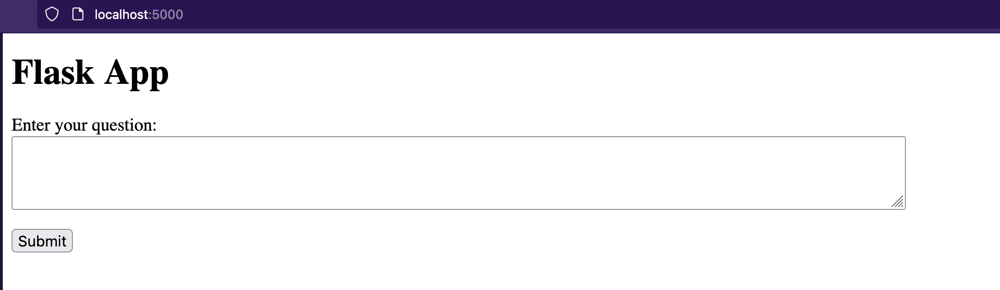

# Flask Application with OpenAI ChatGPT Integration Tutorial

### Introduction

Welcome to this tutorial where you will learn how to create a Flask application that integrates with OpenAI's ChatGPT. This project demonstrates how to build a web interface that interacts with ChatGPT, allowing users to ask questions and receive responses powered by AI.

### What is Flask and Why Use It?
Flask is a lightweight and flexible Python web framework. It's designed for quick development of web applications by wrapping around Werkzeug(*1) and Jinja(\*2). Its simplicity and ability to scale up to complex applications make it an ideal choice for beginners and experienced developers alike. Flask requires little to no boilerplate code for simple applications, making it straightforward to use for quick prototyping but also powerful enough for large-scale applications.

### Flask installation

To get started with Flask, follow these steps:

1. Install flask with pip (python)
```bash
pip3 install flask
```

2. Clone the project repository:
```bash
git clone https://github.com/AF-EL-ZUBAIDI/Flask-OpenAI.git
cd flask_openai
```

3. Set up your environment key in the file main.py

### Usage Instructions
To run the application:

1. Navigate to the project directory.
2. Run the Flask application:
```bash
python main.py
```

3. Open a web browser and navigate to http://localhost:5000/.
4. Interact with the ChatGPT interface on the web page.

You should have this interface on your page:



### Need for a Templates Folder
The `templates` folder is an essential part of Flask applications. It stores HTML files which Flask can render and serve as web pages. This separation of Python code and HTML content adheres to the Model-View-Controller (MVC) architecture, promoting organized and maintainable code. Flask uses the Jinja2 template engine, allowing dynamic data to be injected into HTML files.

### Interaction Between Templates and Python Code
Flask's rendering mechanism bridges the gap between the back-end (Python code) and the front-end (HTML templates). Using the `render_template` function, Flask passes variables from Python code to the HTML templates. These variables can be values, data structures, or even instances of Python classes. This feature enables dynamic content generation on web pages based on user input or other processes.


##### Footnotes:
1. Werkzeug: A WSGI utility library for Python. It forms the foundation of Flask, handling web requests and responses.
2. Jinja2: A template engine for Python, used in Flask to create dynamic HTML pages with conditional statements, loops, and more.